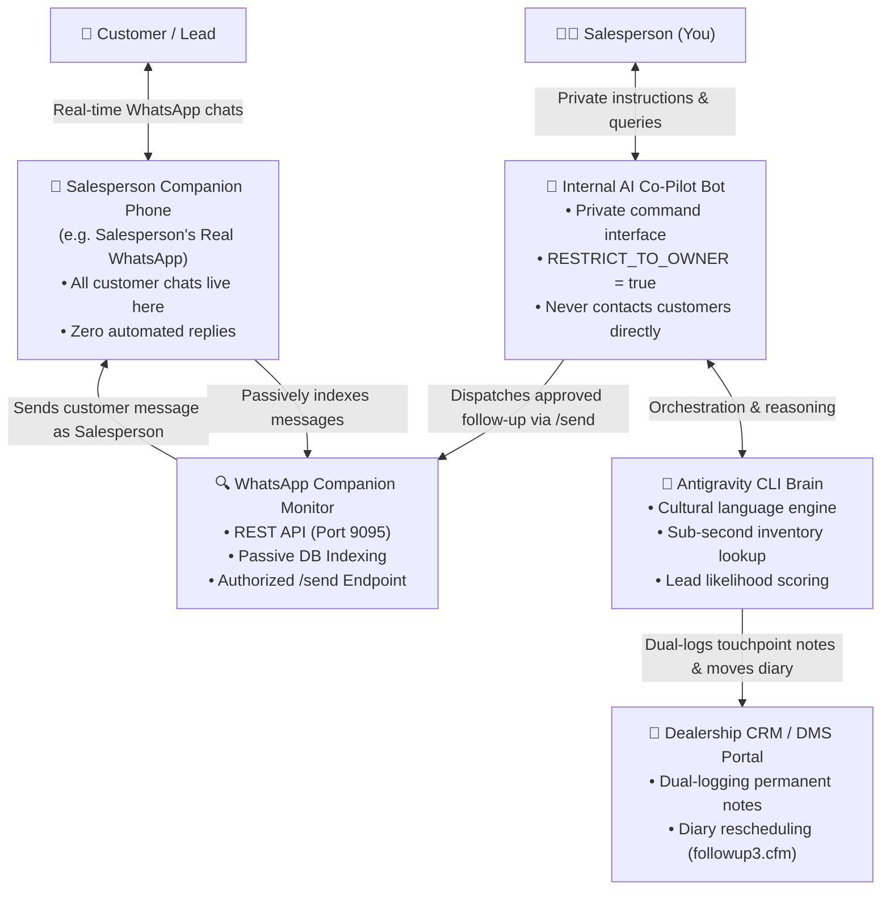

# 🚘 AutoAgent: Dealership OS Harness

[](https://nodejs.org/)
[](https://www.python.org/)
[](https://pm2.keymetrics.io/)
[](https://antigravity.google/)
[](https://opensource.org/licenses/MIT)
[](https://nageljakes.github.io/autoagent/)

**AutoAgent (Dealership OS)** is an autonomous, private AI sales co-pilot and CRM automation harness built specifically for automotive dealerships. It bridges dealership management portals (Dealership CRM / DMS Portal) with real-time WhatsApp customer communication, eliminating manual clerical friction and keeping diary follow-ups completely on track.

---

## 🌟 Sales Companion First Architecture

All customer-facing correspondence is anchored to the **Salesperson's Companion Number** (your real WhatsApp phone). The AI Agent acts as an internal private co-pilot, ensuring zero unprompted bot replies to customers.



### Visual Workflow & Dataflow

```
                                 ┌─────────────────────────┐
                                 │     CUSTOMER / LEAD     │
                                 └────────────┬────────────┘
                                              │
                      Incoming Chats          │  Outbound Messages
                   (Customer Texts You)       │ (Sent from YOUR Phone)
                                              ▼
                    ═════════════════════════════════════════════════
                    📱 SALESPERSON COMPANION PHONE (e.g. Sales Advisor)
                       • All customer conversations live here
                       • Zero automated replies to customers
                    ═════════════════════════════════════════════════
                                              │
                       Passive Indexing       │  Authorized Outbound
                      (Reads WA Messages)     │ (Dispatched as Salesperson)
                                              ▼
                    ┌───────────────────────────────────────────────┐
                    │       JAX WhatsApp Companion Monitor          │
                    │       • REST API (Port 9095)                  │
                    │       • Real-time prospect DB indexing        │
                    │       • Authorized /send bridge               │
                    └───────────────┬───────────────────────────────┘
                                    │
                                    │ Outbound Instructions
                                    ▼
┌───────────────────────────────┐       ┌───────────────────────────────┐
│   SALESPERSON (YOU)           │       │    Antigravity CLI Brain      │
│   • Reviews deals & diary     │◄─────►│    • Cultural language engine │
│   • Gives private commands    │       │    • Sub-second inventory     │
└───────────────┬───────────────┘       │    • Deal heat scoring        │
                │                       └───────────────┬───────────────┘
                │ Private Commands                      │
                ▼ (Internal WhatsApp Chat)              │ Dual-Logging Notes &
┌───────────────────────────────┐                       │ Diary Rescheduling
│  Internal AI Co-Pilot Bot     │                       ▼
│  • Salesperson commands only  │       ┌───────────────────────────────┐
│  • RESTRICT_TO_OWNER = true   │       │   Dealership CRM / DMS Portal │
│  • Zero customer auto-replies │       │   • followup3.cfm diary       │
└───────────────────────────────┘       │   • customer_sa.cfc ERA notes │
                                        └───────────────────────────────┘
```

- **Sales Companion First (Strictly Controlled Customer Messaging)**:
  - **Salesperson Companion Number (Real Phone)**: All customer conversations remain 100% on the salesperson's phone. The monitor indexes customer chats passively and dispatches approved follow-ups directly from this number. Zero unprompted auto-replies to customers.
  - **Internal AI Agent Bot**: Acts strictly as a private assistant for the salesperson. You message this number to give instructions (check stock, move diary, draft proposals, send follow-ups). The agent never chats with customers on its own.
- **Dealership CRM Dual-Logging Engine**:
  - Automatically logs customer touchpoints to the daily diary (`followup3.cfm`).
  - Stamps permanent CRM notes directly into the master ERA dealer record (`customer_sa.cfc`).
  - Evaluates lead heat scores and reschedules follow-ups autonomously.
- **High-Speed Inventory Engine**:
  - Pre-cached local stock search (<10ms) across dealership inventory.
  - Automatic photo gallery downloads and caption formatting for instant WhatsApp delivery.
- **Bulletproof Multi-Tier Language Decision Engine**:
  - Matches customer inbound language (Afrikaans / English).
  - Enforces cultural name guards and professional automotive communication standards.

---

## ⚡ Quickstart: Single-Command Onboarding

Run the following one-liner in your terminal to automatically download the repository and launch the interactive onboarding harness. It will guide you step-by-step through environment configuration, Antigravity CLI login, WhatsApp QR pairing, and Dealer CRM portal connection:

```bash
curl -sL https://raw.githubusercontent.com/Nageljakes/autoagent/main/install.sh | bash
```

*(You can also use `./setup.sh` as an alias).*

### 🗑️ Complete Uninstallation

To cleanly stop and remove all PM2 background services, saved credentials, and repository files:

```bash
curl -sL https://raw.githubusercontent.com/Nageljakes/autoagent/main/uninstall.sh | bash
```

*(Or run `./uninstall.sh` / `npm run uninstall` from within the cloned directory).*

---

## 📋 The 6-Step Onboarding Walkthrough

The `deploy.sh` script automates the entire setup lifecycle:

1. **System & Dependency Verification**:
   - Detects or installs Node.js 22 LTS, Python 3, and PM2.
   - Installs all npm and Python requirements (`curl_cffi`, `beautifulsoup4`, `requests`).
2. **Antigravity CLI Installer & Authentication**:
   - Downloads and installs the Antigravity CLI (`agy`) if not already present.
   - Verifies authentication status so the AI brain is active.
3. **Salesperson Profile & Communication Policy**:
   - Configures your preferred name, primary WhatsApp phone number, and branch.
   - Enforces the Sales Companion First policy (`RESTRICT_TO_OWNER=true`).
4. **WhatsApp Pairing (Dual QR Codes)**:
   - **QR Code 1 (Salesperson Companion Monitor)**: Pairs your primary sales phone. Mirrors ongoing deals and customer replies passively with zero auto-replies.
   - **QR Code 2 (Internal AI Co-Pilot Bot)**: Pairs your private assistant bot number. This number is strictly for you to give instructions to the agent.
5. **Dealership CRM / Dealer Portal Setup**:
   - Prompts for CRM username and password.
   - Securely stores credentials with `chmod 600` permissions.
   - Performs a live login test and immediately synchronizes today's diary.
6. **Daemon Launch via PM2**:
   - Starts the monitor, WhatsApp agent, and background services under PM2.
   - Saves process list for automatic reboot recovery.

---

## 📂 Repository Structure

```
autoagent/
├── deploy.sh                     # Master single-command onboarding script
├── setup.sh                      # Quickstart alias wrapper
├── uninstall.sh                  # All-in-one uninstaller script
├── ecosystem.config.cjs          # Portable PM2 process management config
├── package.json                  # Root dependencies and operational npm scripts
├── requirements.txt              # Python dependencies for scrapers and portal tools
├── .env.example                  # Environment configuration template
├── .gitignore                    # Production-grade gitignore (prevents leaking sessions)
├── LICENSE                       # MIT License
├── scripts/
│   ├── pair_session.mjs          # Standalone terminal QR pairing utility
│   └── generate_crm_sync.py      # CRM & prospect synchronization tool
├── skills/                       # Antigravity Skills
│   ├── autohub-portal/           # Dealership CRM login, diary scrapers, quote downloaders
│   ├── bb-used-cars/             # Used car stock search and image scraper
│   ├── dealership-os-architecture# Dealership workflow patterns & domain models
│   ├── low-resource-stealth-scraper# Cloudflare/Akamai bypass and batch scrapers
│   └── whatsapp-monitor/         # Prospect query, context resolution, and follow-ups
├── jax-whatsapp-agent/           # WhatsApp conversational agent bot
├── jax-whatsapp-monitor/         # Passive WhatsApp indexing bridge & REST API (port 9095)
├── jax-telegram-agent/           # Optional Telegram assistant bridge
└── jax-shared/                   # Shared scripts, inventory data skeletons, and watchdog
```

---

## 🛠 Management & Useful Commands

Once deployed, manage your Dealership OS services using standard PM2 commands:

```bash
# View running status of all services
pm2 status

# View live consolidated logs
pm2 logs

# View specific service logs
pm2 logs jax-whatsapp-monitor
pm2 logs jax-whatsapp

# Restart all services
pm2 restart all

# Query WhatsApp monitor REST API
curl -s http://127.0.0.1:9095/prospects | jq .
curl -s http://127.0.0.1:9095/history/<your_phone> | jq .

# Search local pre-owned vehicle stock
PYTHONPATH=skills/autohub-portal/scripts python3 skills/bb-used-cars/scripts/search_stock.py -q "Sedan / SUV"

# Completely uninstall Dealership OS and cleanup
./uninstall.sh
```

---

## 🔒 Security & Privacy

- **Zero Session Tracking**: All Baileys session keys, WhatsApp tokens, and SQLite prospect databases are strictly excluded from git tracking.
- **Local Isolation**: All customer data and chat histories remain strictly inside your private local environment.
- **Credential Protection**: Portal credentials in `~/.config/dealer_credentials.env` and `.env` are protected with restricted file permissions (`chmod 600`).

---

## 📄 License

MIT License. Copyright (c) 2026 AutoAgent Contributors.

Database configuration: `SQLITE_DB_PATH` selects the WhatsApp message database (default `jax-shared/data/prospects.db`). `PROSPECT_HISTORY_DB` selects the separate CRM history database (default `data/scratch/prospect_history.db`). Export these variables for Python/cron jobs; PM2 also reads the root `.env`. Relative paths resolve from the repository root, independent of the working directory. Set `PROSPECT_HISTORY_DB` explicitly when retaining an older database under `~/.gemini`.
